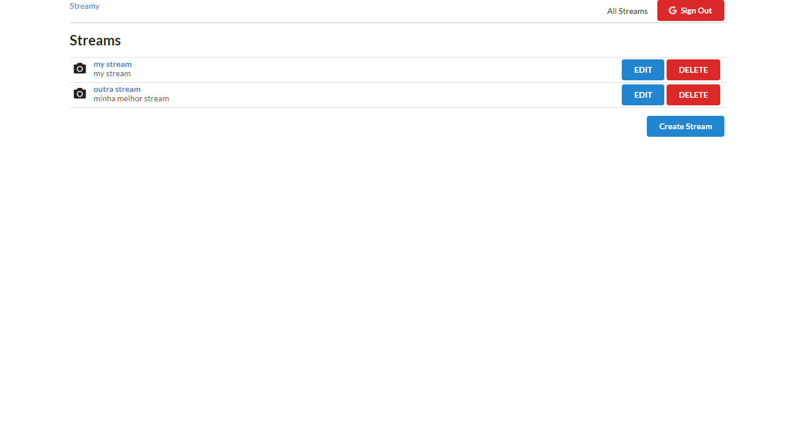
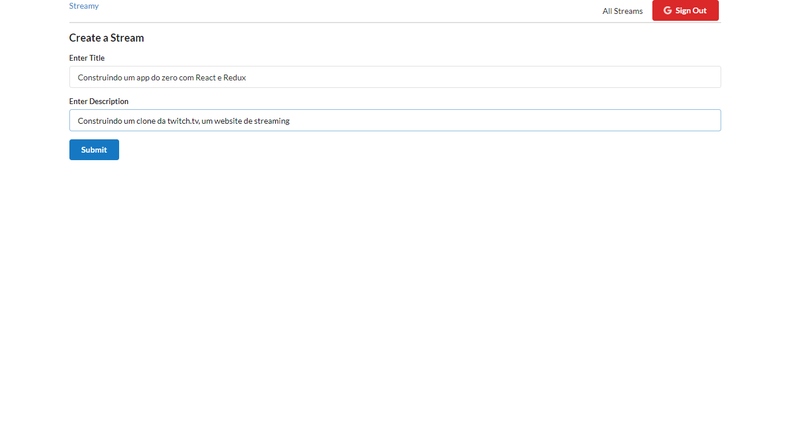
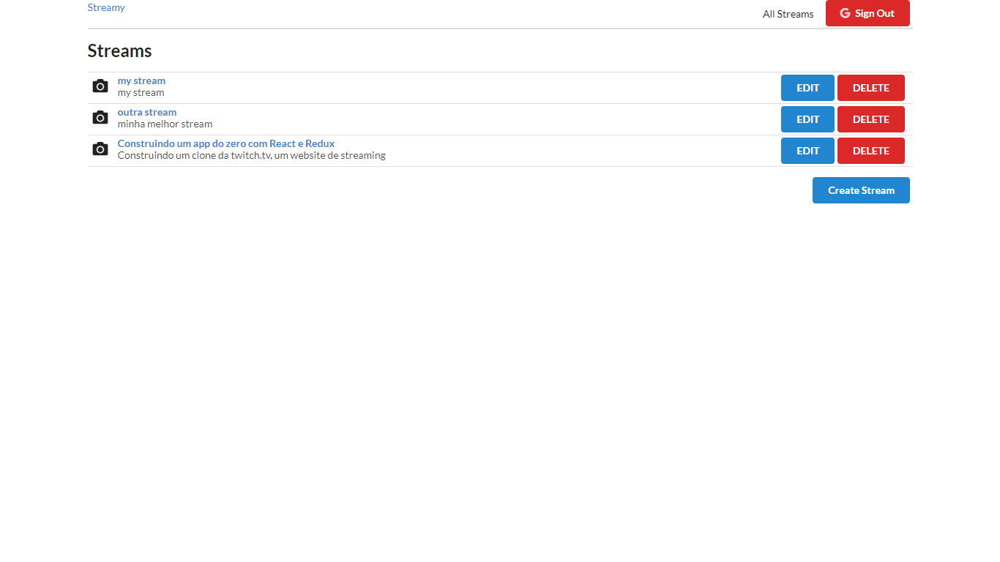
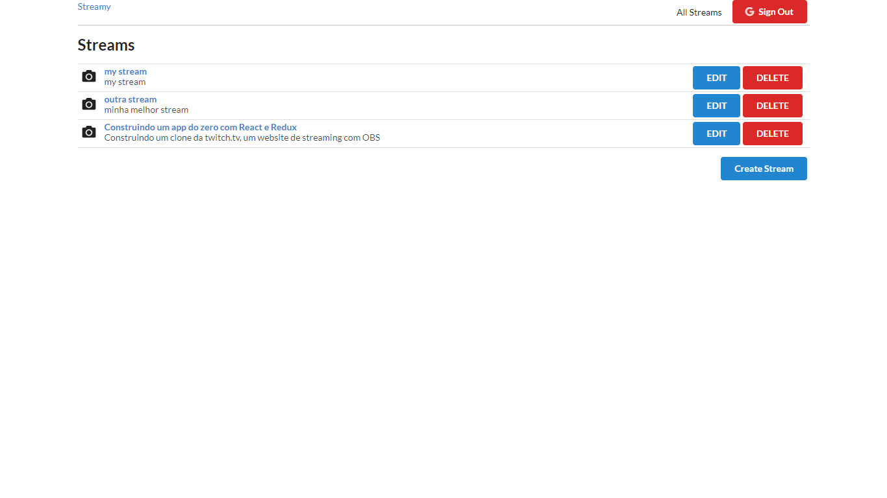

<h1 align="center">
    Twitch.Tv Core Clone
</h1>

 

  

 

# 💻  Streams

## Web

   
    
    
    
     

## Server

### Description

#### Salvar as informações dos usuários e de suas streams - all using typescript. 

## RTMPSERVER

### Description

#### Comunicar com o aplicativo de streaming OBS e transmitir para o Web - all using typescript. 

## 🚀  Tecnologias

Esse projeto foi desenvolvido com as seguintes tecnologias:

- [Node.js](https://nodejs.org/en/)
- [TypeScript](https://www.typescriptlang.org/)
- [React](https://reactjs.org)
- [Redux](https://redux.js.org/)

## :memo: Licença

Esse projeto está sob a licença MIT. Veja o arquivo [LICENSE](LICENSE.md) para mais detalhes.

---

